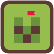
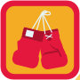
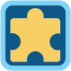
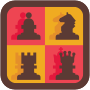
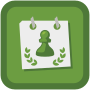
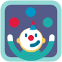

# chess-achievements

90 icons · 90×90 · multicolor

## Preview

|  |  |  |  |  |  |  |  |
| --- | --- | --- | --- | --- | --- | --- | --- |
|  |  |  |  |  |  |  |  |
|  |  |  |  |  |  |  |  |
|  |  |  |  |  |  |  |  |
|  |  |  |  |  |  |  |  |
|  |  |  |  |  |  |  |  |
|  |  |  |  |  |  |  |  |

*Showing 48 of 90 icons. Browse [`icons/`](./icons) for the full set.*

## Usage

### SVG (CDN)

```html

```

Icons contain embedded colors — use `` directly. CORS is enabled — load from any origin. Assets are immutably cached.

### Download

Browse [`icons/`](./icons) for individual SVGs.

---

Managed by [JustDraw](https://justdraw.dev)
